Homework No. 2
================
Victor H. Ramirez, EID vhr267
March 12, 2021

# 1. Data visualization

## 1.1 UT Capital Metro average boarding frequencies

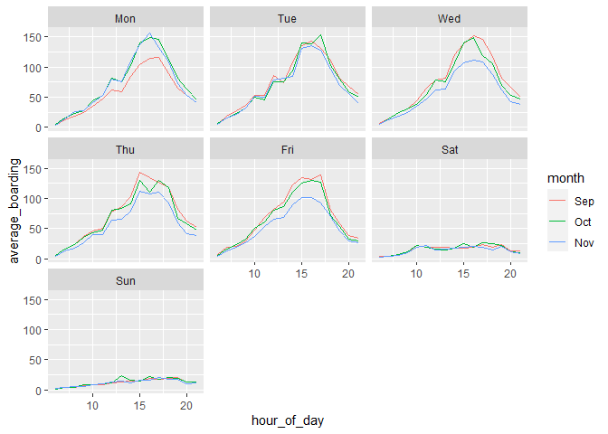<!-- -->

***Figure 1.1**. Boarding frequencies of the Capital Metro in the UT
Austin area: Boarding frequencies differ significantly on weekdays from
the weekend, which tend to be much lower. During the weekdays, peak
hours occur at around 4:00 p.m., when students and workers leave the
Campus. In Mondays of September and Fridays of November tend to display
lower boarding averages, possible because of the beginning-end of the
semester, some Mondays in September and Fridays in November would be
left out of the calculation, bringing down the average estimates.*

## 1.2 Effect of temperature on UT Capital Metro boarding frequency

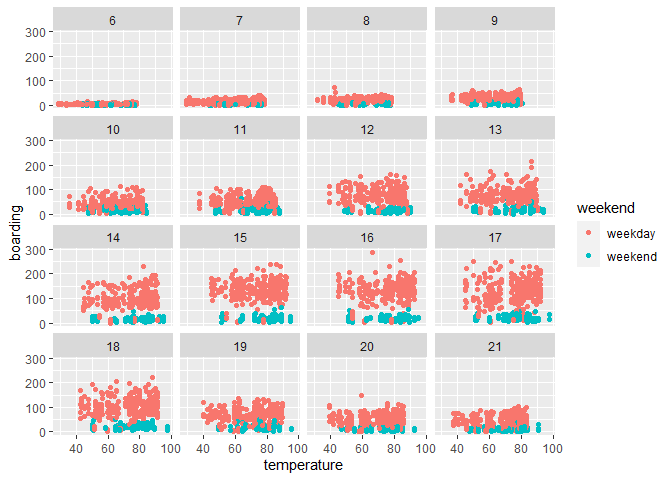<!-- -->

***Figure 1.2**. Effect of the temperature on boarding frequencies: even
though one could assume that the temperature (as a proxy of weather
conditions) would have an incidence on boarding frequencies, a
relationship between these two variables seems to be spurious as it
picks on the effect of the time of the day. We may observe this in that,
for a given specific time frame (one hour), temperature’s effect is
negligible as the scatter plots do not show clear trends, either for the
weekday or for the weekends.*

# 2. Saratoga house prices

The objective of this section is to examine out-of-sample forecasting
performance for linear (parametric) model and k-Nearest Neighbors (KNN)
models (non-parametric).

When selecting a class of model, there is a trade-off between
tractability (how simple is the model employed) and flexibility (how
well the model may capture non-linearities and other irregularities in
the data). This is akin to selecting between the “how good” and the
“why” of the forecast. Thus, considerations expand in many cases extend
beyond the mere forecast performance of the selected method.

In this case, we are interested in forecasting Saratoga house prices on
basis of a series of characteristics of the house (features). There are
16 features in total. To prepare the data, I start by encoding
categorical and logical variables by assigning them an integer value.
Next, to account for the fact that these features take values that vary
considerably between them, I perform normalizations of the data by
substracting the variable’s estimation set mean and dividing by it’s
standard deviation; thus centering them on zero and expressing their
values as number of standard deviations.

## 2.3 Forecast performance

To asses the performance of the forecast, we employ the Root of the Mean
Squared Error (RMSE) of out of sample forecasts. The RMSE of all models
is compared to a Baseline Model (BM)

The out-of-sample RMSE is averaged through cross-validation.

## 2.1 Linear models

First, I examine the predictive power of the individual variables, and
compare them to the baseline model. To this end, I compare the
cross-validated RMSE of univariate models that include these features,
over 10 folds. The distributions of the RMSE obtained for the folds are
presented below.

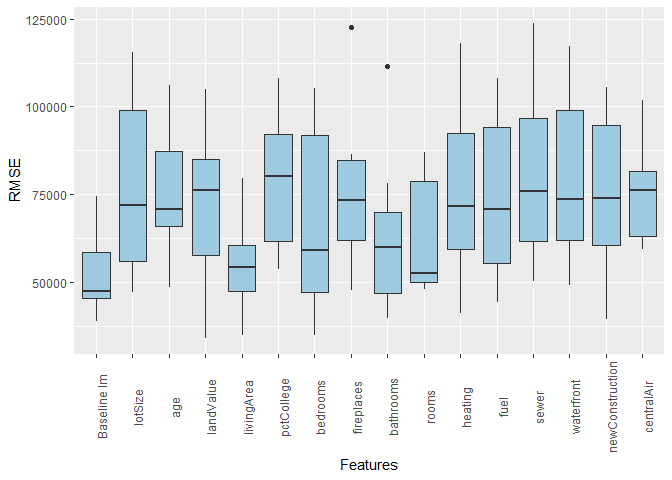<!-- -->

***Figures 2.1**. The best individual predictors for Saratoga house
prices are living area, bathrooms, rooms and land value. An univariate
model that includes living area performs closely to the baseline model
in out-of-sample predictions.*

This exercise indicates that living area, number of bathrooms, number of
rooms and land value are the best predictors of house prices in
Saratoga. I combine these variables on a model, which I will call
Challenge Model (CM) and compare its forecast performance with the BM
and the best univariate model (the one with living area as regressor).
This is because, as a principle, we try to mantain a parsimonious model;
thus the inclussion of all of these variables is adequate if the
forecast performance increases.

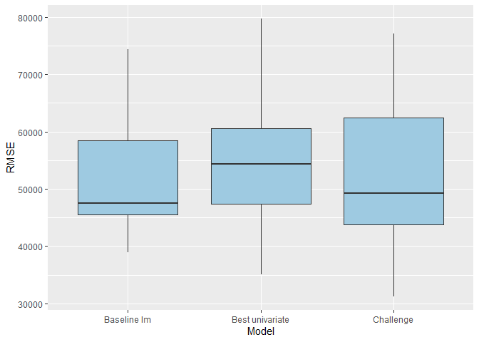<!-- -->

***Figure 2.2**. A model that includes the 4 best indivdual predictors
outperforms both the baseline and the best univariate model.*

I continue to further examine if the inclusion of some interactions may
better performance. As a modeling principle, all variables involved in
an interaction are also included in the model. The best alternative that
I find incorporates an interaction between number of rooms and a logical
variable which indicates if this is a new construction.

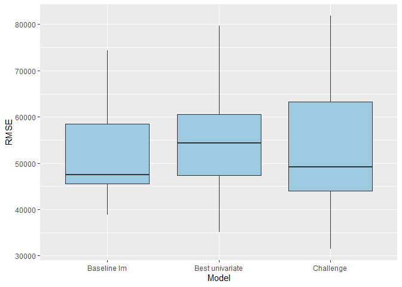<!-- -->

***Figure 2.3**. The performance of the model is marginally improved if
we include interactions between an indicator variable of new
construction and the number of rooms.*

The incorporation of the interaction variable increased the forecast
performance. This makes sense to me, since there is a tendency to reduce
the number of rooms in new constructions (apartments, studio apartments,
etc.), so it makes sense that in recent times, the number of rooms
should impact more profoundly the price of houses than in the past. This
will be my Best Linear Model.

## 2.2 KNN models

These models are very flexible but there are also an very large number
of combinations of features and parameters over which we must make
decisons (the combinations of features to be included and the value of
the k-parameter of the model). To simplify things, and to be able to
better compare the out-of-sample forecasting capacity of the two
methodologies, I restrict to the three models of the last section: the
baseline, the best univariate and the best linear model.

Next, to determine the optimal k-parameter, I explore the
cross-validated forecasting performance for values that range from 5 to
400 (as permitted by the data).

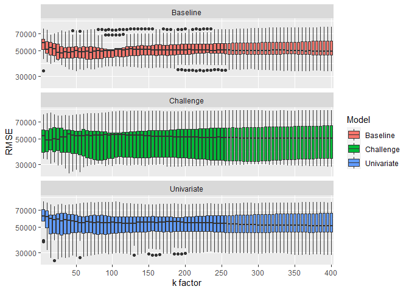<!-- -->

***Figure 2.4**. The best performing KNN model has the specification of
the best linear model and a k factor with value of 15.*

I find that the best linear model especification (call it Best KNN
Model) with a k=15 outperforms the other two especifications of KNN
models.

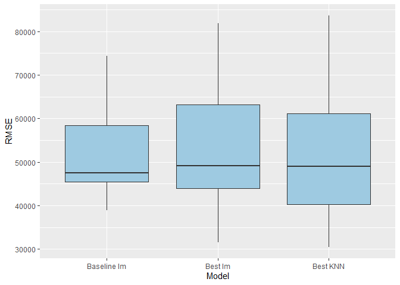<!-- -->

***Figure 2.5**. The KNN model outperforms on average the best linear
model, although the RMSE is more variable.*

Further, I find that the cross-validated RMSE of the KNN model
outperforms the baseline and the best linear model; however, there is
more variability in the RMSE for the KNN than for the best linear model.

# 3. Classification and retrospective sampling

In this problem, we examine the potential effects of retrospective
sampling on model estimates. The problem asks us to look at a German’s
bank defaults data, in order to develop a logit model to predict when a
particular loan will go on default. However, because of the low
frequency of default occurrences, a sample of defaulted loans was
selected and matched with other loans with similar characteristics. This
procedure, however, has a very strong counterintuitive effect on the
estimated coefficients, as will be discussed.

To begin, we may observe in the figure below the fraction of defaulted
loans grouped by the debtor credit history.

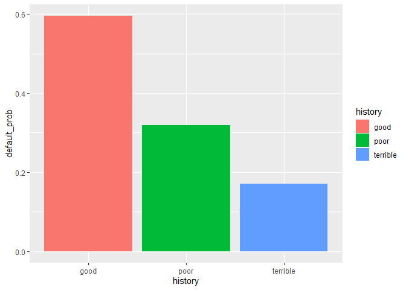<!-- -->

***Figure 3.1**. In the sample, the probability of default is reduced as
the debtor’s credit history worsens, result that is counterintuitive.*

This is also reflected in the model estimated parameter’s. According to
the model, a person with poor credit history reduces her odds of
entering on default by a factor of 0.78, approximately, with respect to
a person with good credit; and the person with terrible credit history
reduces its probability by a factor of 0.68.

    ##         (Intercept)            duration              amount         installment 
    ##                0.37                0.01                0.00                0.04 
    ##                 age         historypoor     historyterrible          purposeedu 
    ##                0.00               -0.25               -0.38                0.14 
    ## purposegoods/repair       purposenewcar      purposeusedcar       foreigngerman 
    ##                0.02                0.16               -0.13               -0.16

***Table 1**. Logit model estimated coefficients. According to the
model, the probability of default increases as the quality of the credit
history of the person is greater.*

As discussed above, these results are likely consequence of inadequate
sampling. Because defaults are so rare, It is also very likely that
persons with poor or terrible credit history are also very rare. This
means that, if the correlation of this variable with default is not too
big, when we take a random sample of defaulted credits, it is very
likely that good credit histories will be overrepresentated, and thus
there will be an appearance of a positive relationship between credit
history quality and default probability, which would be wrong.

# 4. Children and hotel reservations

The objective of this section is to be able to adequately estimate and
validate the adequacy of a classification model, in order to be able to
forecast whether a particular booking will include children, given a set
of accompanying features. It is often unknown whether a child will be
included in the guests of a reservation until the moment of the
check-in, it is very valuable to be able to predict this event, as it
impacts on costs.

## 4.1 Model building

In this section, a linear model is developed to forecast the probability
that a booking will include a child. Two models are employed as
baseline, and performance is assessed through cross-validation with 100
folds (since the sample size allows it). The figure below shows the
distribution of the individual RMSE estimations for each of the folds
through box plots.

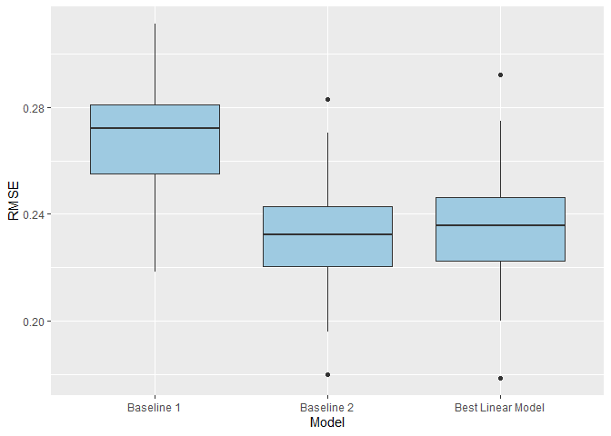<!-- -->

***Figure 4.1**. The Best Linear Model outperforms the Baseline Model 1,
but not the Baseline 2.*

The figure 4.1 above shows that I am not able to outperform the Baseline
2 model in terms of RMSE. The model, however is relatively simpler and
the mean RMSE difference is not significant, so I continue to work with
this model.

## 4.2 Model validation

To examine the adequacy of the Best Linear Model’s (BLM) forecasts, I
construct the ROC curve with another data set, shown below in Figure
4.2. This figure shows a parametric curve that represents the relation
between ratios of true positives and false positives, for a given
discrimination threshold. Since in reality the forecast of the linear
model consists of a real number, we must set a threshold to help us
decide whether a particular number must be understood as a forecast of a
booking with children. This figure helps us to comprehend, thus, the
effect of the threshold on the error ratios.

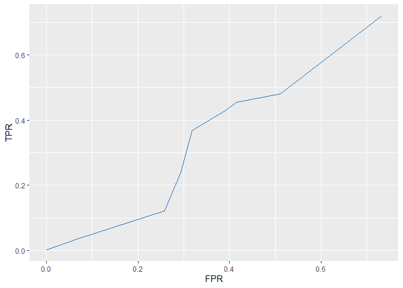<!-- -->

***Figure 4.2**. The ROC of the best linear model shows that the model
usually fails close to 50% of the time when predicting a booking with
children, for any threshold probability. The best performance comes with
a threshold of about 0.4.*

The Figure 4.2 above wanders closely to a 45° line that passes through
the origin. This means that the model performs similarly to a random
guess of the result of a coin flip. In general, we would want that the
ROC curve be as up and to the left as possible, since then the ratio of
true positives for a given ratio of false positives would be greater.

## 4.2 Model validation

The effect of the model performance is also evaluated on basis of the
predicted number of bookings with children. The evaluation data set is
partitioned on 20 folds of about the same size and with a number of
entries similar to that of a busy weekend. Then, the number of expected
bookings with children is forecasted with the model and a probability
threshold of about 0.4. The number of predicted bookings with children
is then compared with the actual number of bookings with children for
the same fold. A ratio is constructed, such that if the ratio is less
than 1 it means that we have underestimated the number of bookings with
children, and vice versa. A distribution plot for the ratios of the 20
folds is presented below.

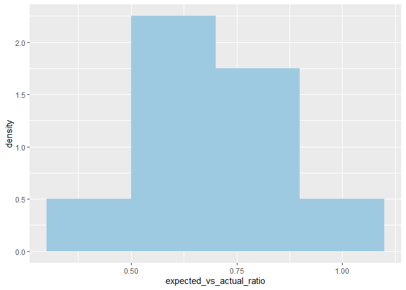<!-- -->

***Figure 4.3**. On average, the number of bookings with children on a
single busy weekend are underestimated by about 30%.*

Figure 4.3 above shows that the forecasted number of bookings with
children is biased as is consistently below the actual number. This
result is surprising, since the probability threshold is less than 0.5,
so one could assume that this would bias the forecast in the other
direction, but could be a result of the actual number of bookings with
children beeing too low. In any case, these results show the
consequences of out-of-sample underperformance of the model.
